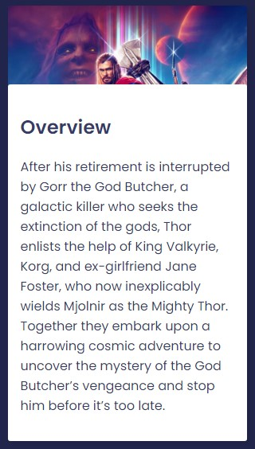

# The Movie App

This project was bootstrapped with [Create React App](https://github.com/facebook/create-react-app).

The required modules
`npm install`

Runs the app
`npm start`

Runs the app in the development mode.\
Open [http://localhost:3000](http://localhost:3000) to view it in your browser.

The page will reload when you make changes.\
You may also see any lint errors in the console.

## Get Movies With The Movie Database (TMDB) API - by popularity

## Get Movies With The Movie Database (TMDB) API - by search

## Movie Box

## Hover The Movie Box

